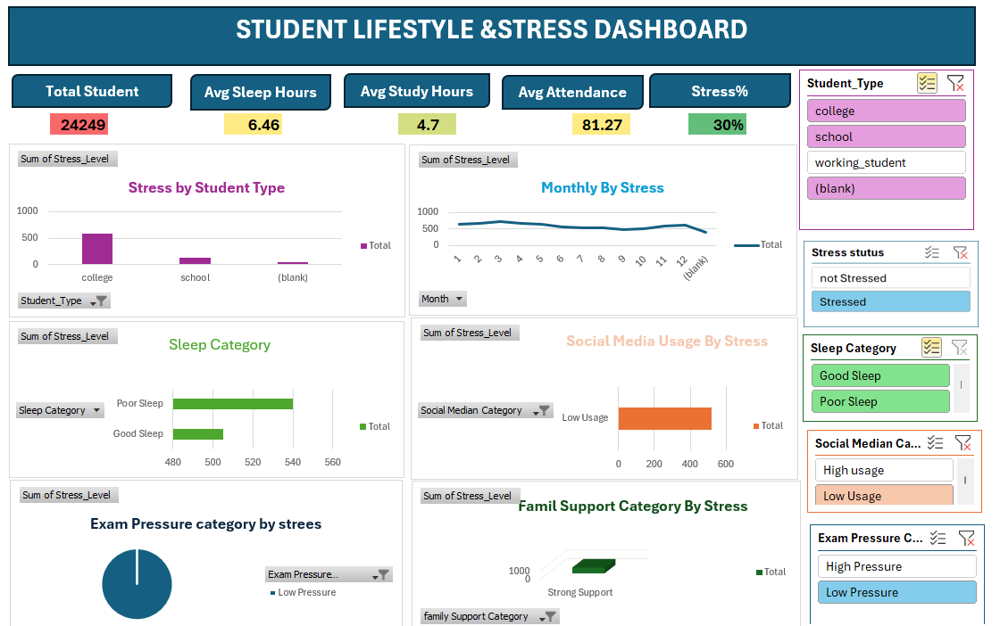

# 📊 Student Lifestyle & Stress Dashboard

An interactive Power BI dashboard analyzing student lifestyle habits — sleep, study time, attendance, social media usage, and exam pressure — and their relationship to stress levels.



## 📌 Overview

This dashboard explores lifestyle and behavioral data from **24,249 students** to understand key drivers of stress. It combines KPI cards, trend analysis, and category breakdowns to help identify patterns across student types, sleep habits, social media usage, exam pressure, and family support.

## 🎯 Key Metrics (KPIs)

| Metric | Value |
|---|---|
| Total Students | 24,249 |
| Avg Sleep Hours | 6.46 |
| Avg Study Hours | 4.7 |
| Avg Attendance | 81.27% |
| Stress % | 30% |

## 📈 Visuals Included

- **Stress by Student Type** – Bar chart comparing stress levels across college, school, and working students.
- **Monthly By Stress** – Line chart tracking stress trends across months.
- **Sleep Category** – Bar chart comparing stress levels for Good Sleep vs Poor Sleep.
- **Social Media Usage By Stress** – Bar chart comparing stress by usage level (High/Low).
- **Exam Pressure Category by Stress** – Pie chart showing stress distribution by exam pressure.
- **Family Support Category By Stress** – Funnel chart showing stress by level of family support.

## 🔍 Filters (Slicers)

The dashboard supports dynamic filtering by:
- **Student Type** – College, School, Working Student
- **Stress Status** – Stressed / Not Stressed
- **Sleep Category** – Good Sleep / Poor Sleep
- **Social Media Category** – High Usage / Low Usage
- **Exam Pressure Category** – High Pressure / Low Pressure

## 🛠️ Tech Stack

- **Power BI Desktop** – Dashboard design & data modeling
- **DAX** – Calculated measures (Stress %, Averages)
- **Power Query** – Data cleaning & transformation

## 📂 Repository Structure

```
├── Student_Lifestyle_Stress_Dashboard.pbix   # Power BI dashboard file
├── data/                                      # Source dataset(s)
├── dashboard_preview.png                      # Dashboard screenshot
└── README.md                                  # Project documentation
```

## 🚀 How to Use

1. Clone this repository:
   ```bash
   git clone https://github.com/<your-username>/student-lifestyle-stress-dashboard.git
   ```
2. Open `Student_Lifestyle_Stress_Dashboard.pbix` in **Power BI Desktop**.
3. Use the slicers on the right to filter by student type, sleep habits, exam pressure, and more.

## 📊 Data Source

*(Add details here — e.g., dataset name, source link such as Kaggle, and a brief description of the columns used: Student_Type, Sleep_Hours, Study_Hours, Attendance, Stress_Level, Social_Media_Usage, Exam_Pressure, Family_Support.)*


